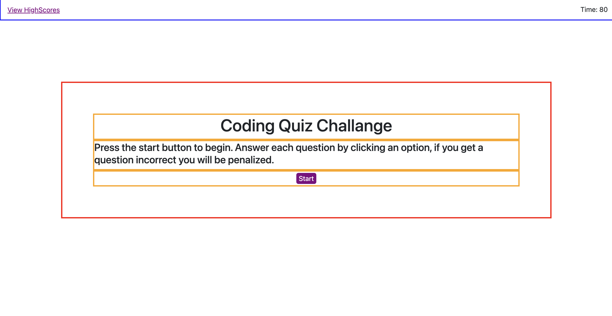
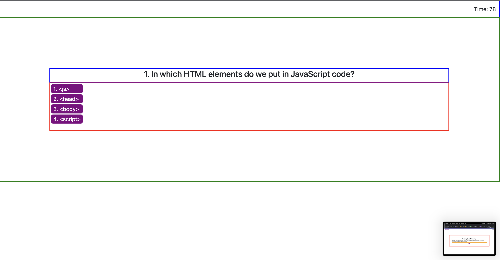
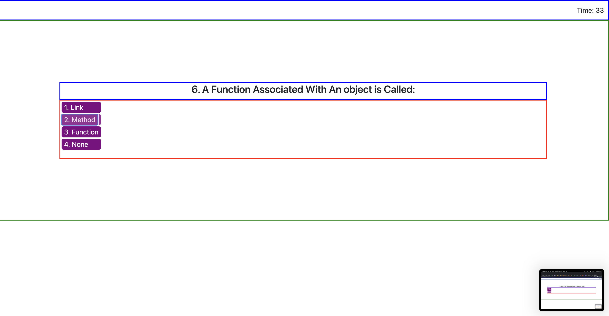
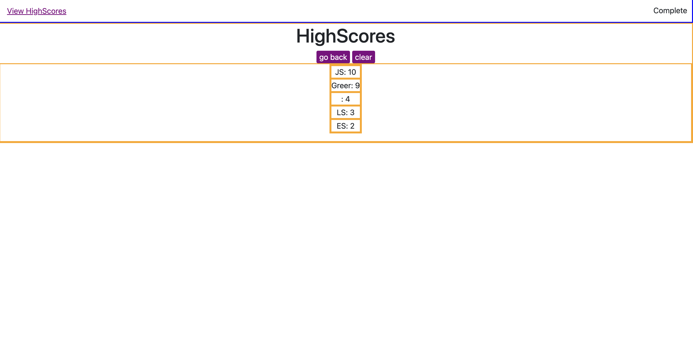
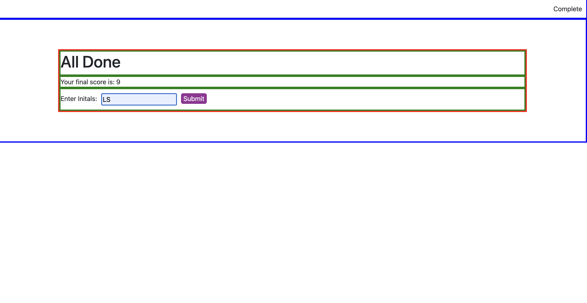
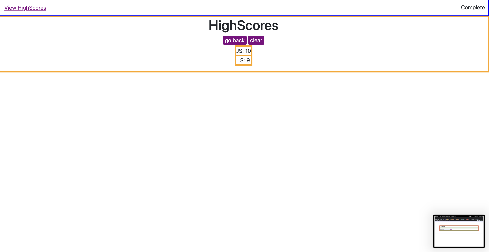
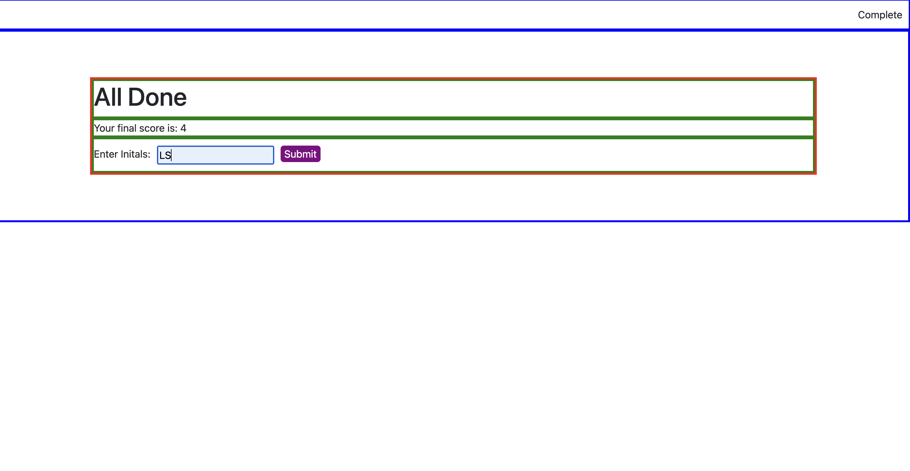
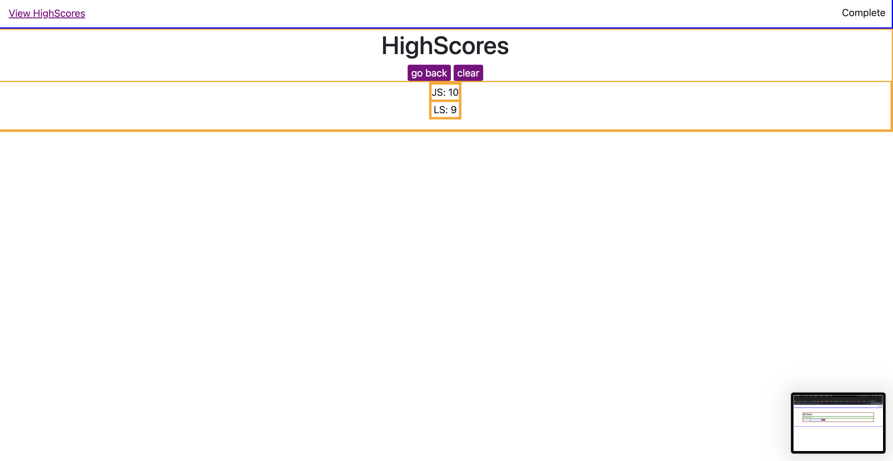

# JS-Quiz

##Description

This site starts with a overview of the quiz. The user also has the ability to view previous high scores set by other users. The game start witha click of the start button. Then the timer start and the user must input their desired answer, an incorrect answer will result in a penalty. After the questions are completed the user will be given their score along with an input field that receives the values and adds them to the leaderboard. If the User name is taken the highest value will be displayed using that name. On submit the user will be pushed to the leaderboard where they will be able to either return to the starting menu or clear the leaderboard of values.

## Output

Images of the site are shown below but the site contains working links, transitions, proper sizing, along with meeting all the requirement needed for completion of the project.

Pictures of the site will be provided bellow:

## Pages

https://joeychez23.github.io/JS-quiz-4/

## Repo

https://github.com/Joeychez23/JS-quiz-4
